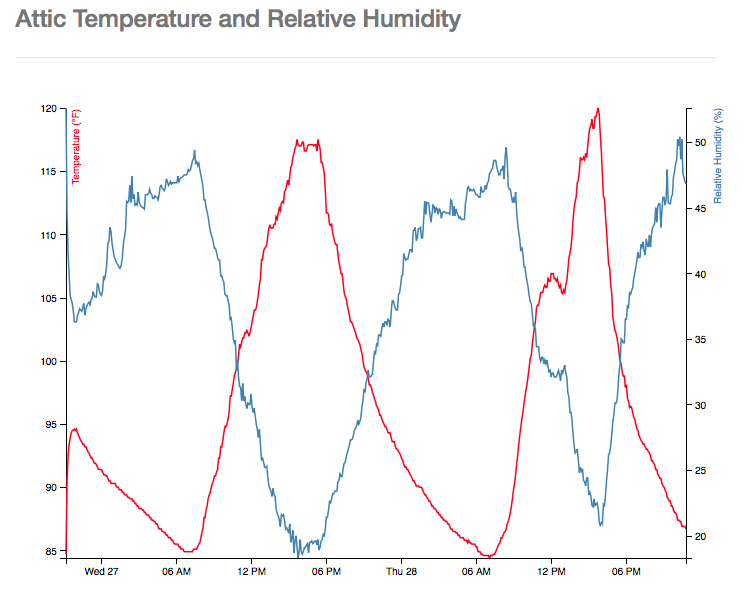

# Visualizing Temperature Data in D3

This data was generated with an [Adafruit temperature and humidty sensor](https://www.adafruit.com/products/385) wired into a Raspberry Pi that collected temperature and relative humidity readings of our attic for 24 hours. The timeseries was then plotted on chart using [d3](https://d3js.org) to visualize the relationship. The data was captured using a modified version of Adafruit's [Python module](https://github.com/adafruit/Adafruit_Python_DHT) and captured into a JSON file.
